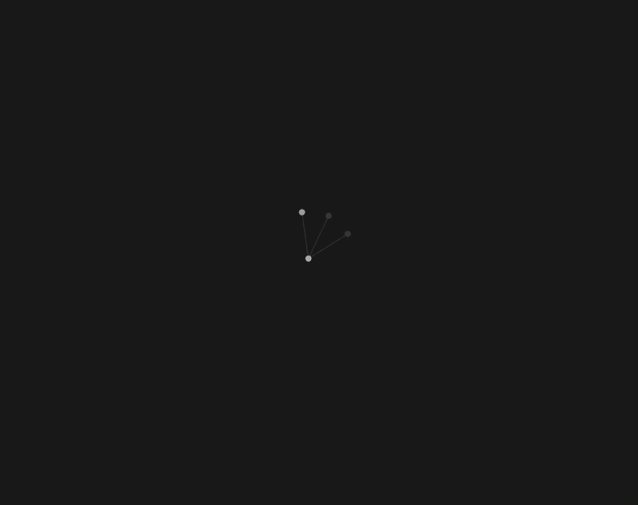

# Agentic Second Brain

*A Second Brain template structured and maintained by Artificial Intelligence agents.*

[Getting Started](#getting-started) • [Why Obsidian?](#why-obsidian) • [Structure](#directory-structure) • [Philosophy](#usage-philosophy) • [Origin](#why-does-this-exist)

An ecosystem designed for **Zero Friction**. The goal is to allow you to dump unstructured ideas, code snippets, or thoughts via chat, leaving the responsibility of modeling and categorization to the AI. The AI acts as a "Digital Gardener", creating crosslinks (Zettelkasten) and keeping your cognitive profile and priorities constantly updated.

  
   
  <em>AI acting in the background: notes being created and connected organically in the Obsidian Graph View while the user just chats.</em>

## Getting Started

Installing this ecosystem is as simple as giving an order to your assistant. No need to manually configure folders or copy rules.

### Step-by-Step

1. **Copy the link** of this repository:
   `https://github.com/Guilherme-L-C/agentic-second-brain-template`
2. **Paste it in the chat** of your AI Agent (Antigravity, OpenCode, Claude Desktop, etc) along with the command:
   > *"Read the AI_INSTALL.md file and install this repository's template."*
3. **Done! Start using it.** 
   Your Agent will read the system instructions, clone the files to your machine, self-configure, and open Obsidian automatically. You just need to answer its onboarding questions!

## Why Obsidian?

[Obsidian](https://obsidian.md/) is the perfect interface (the "frontend") for the AI's mind. It works entirely with local `.md` (Markdown) files.

- **Privacy and Simplicity:** Your "Brain" lives on your hard drive. The AI modifies plain text files locally, without relying on proprietary APIs.
- **Graph View:** Obsidian's *Graph View* feature allows you to physically see the synapses happening.
- **Future-proof:** If the AI changes or if Obsidian ceases to exist, your memories will still be plain text files.

## Directory Structure

- **`00-System/`**: The operational engine. Contains the AI guidelines, priority table, subagent prompts, and your Profile.
- **`00-Inbox/`**: Dump area (buffer). The AI allocates early-stage ideas and drafts that still need to be polished.
- **`01-Projects/`**: Active notes tied to tangible projects, with defined scopes and deadlines.
- **`02-Notes/`**: The permanent knowledge base (Zettelkasten). Documentation, conceptual summaries, and consolidated learnings.

> [!NOTE]
> The repository includes subagent definitions (in `00-System/Subagents.md`) and a script for native integration with macOS Calendar (`00-System/Scripts/apple_calendar.js`). The AI can adapt these tools according to your operational environment.

## Usage Philosophy

- **Maximum Delegation:** Avoid creating files or formatting notes manually. Communicate with the AI naturally: *"I had an idea for a cache system. Save it in projects, connect it with the Redis notes, and set the priority to medium."*
- **Organic Evolution:** `User Profile.md` and `Memory Weights.md` are living documents. As you interact and show preferences, the AI should silently update these parameters.

## Why does this exist?

Traditional note organization often creates friction. Interrupting your train of thought to create files, define tags, or structure folders harms productivity.

Furthermore, interacting with AI agents often suffers from the "blank slate" problem — every new chat session forgets your context. This repository solves that by giving your agent a persistent, continuously updated long-term memory. Whenever you start a new session, the agent already knows your active projects, technical tastes, and current priorities because it reads its own garden.

The idea behind this project is to invert standard logic: **use Artificial Intelligence not just as a passive chat, but as a "Digital Gardener" acting directly on your files.** 

This template consolidates a structure where the user just "dumps" raw material, and the Agent takes charge of categorizing and connecting the dots, keeping the system clean with **zero friction**.

## Author

Created by **Guilherme Leite** ([@Guilherme-L-C](https://github.com/Guilherme-L-C)).
